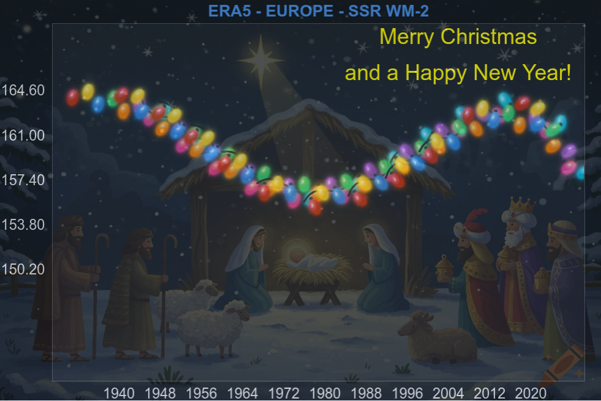

# 🎄 Interactive Christmas Lights Visualization  
*A festive, interactive Bokeh app that transforms climate data into glowing Christmas lights.*



---

## ✨ Overview

This project turns time-series data (default: climate temperature anomalies) into a smooth animated string of Christmas lights.  
It’s built with **Python + Bokeh**, offering a fully interactive interface where you can customize:

- Background images  
- Light styles, size & count  
- Text messages (two lines)  
- Text color, font size & position  
- Chart titles  
- Climate variables (ERA5 demo)  
- Custom dataset upload (CSV/TXT/XLS/XLSX)

It is both a playful holiday visualization and a creative way to explore real climate data.

---

## 🖼️ Additional Preview


---

## 🚀 Features

### 🌍 Climate Data
- Auto-loads `climate_yearly_data.csv` (if available)
- Switch between climate variables
- Smart axis rescaling
- Fallback to internal default dataset

### 💡 Christmas Light Animation
- Polynomial smoothing of the data curve
- Evenly spaced lights via arc-length parameterization
- Realistic rotation angles based on curve slope
- Adjustable:
  - Number of lights  
  - Light size  
  - Light icon image

### 🎨 Customizable UI
- Background image selection
- Background opacity slider
- Custom chart title
- Two text lines with:
  - Position sliders  
  - Color picker  
  - Font size slider  

### 📤 File Upload Support
Upload your own data formatted as:
```
year,value

1990,0.12

1991,0.09
```

CSV, TXT, XLS and XLSX are supported.

---

## 📦 Installation

### 1. Clone the repository
```bash
git clone https://github.com/mixstam1821/ChristmasApp.git
cd ChristmasApp
```
### 2. Install dependencies
```bash
pip install -r requirements.txt
```
### 3. Run the app
```bash
bokeh serve --show ChristmasApp.py
```


